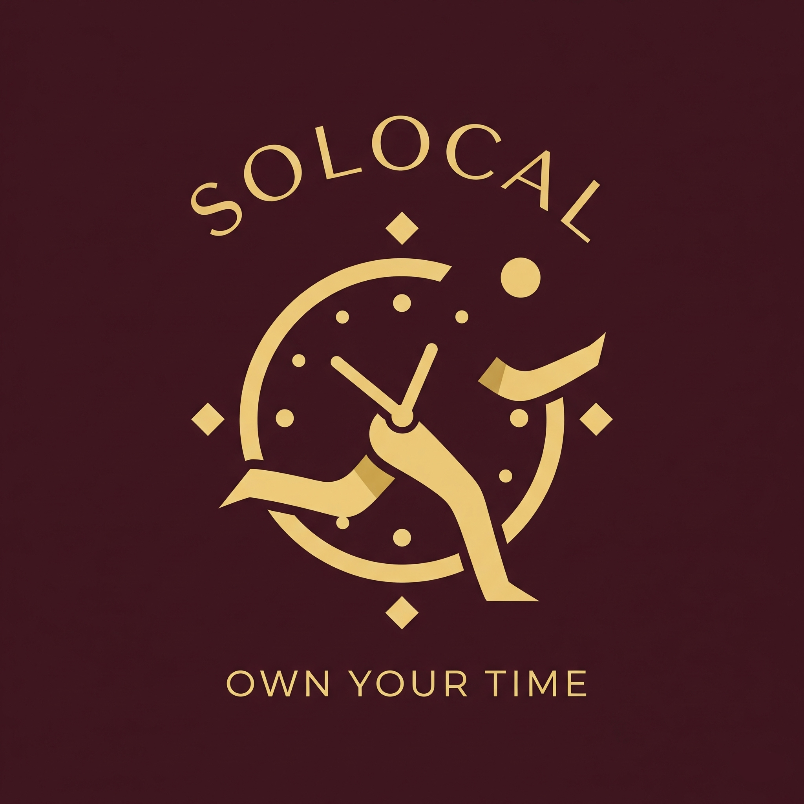

<!-- Copyright notice for this README.md template -->

<!-- MIT License

Copyright (c) 2021 Othneil Drew

Permission is hereby granted, free of charge, to any person obtaining a copy
of this software and associated documentation files (the "Software"), to deal
in the Software without restriction, including without limitation the rights
to use, copy, modify, merge, publish, distribute, sublicense, and/or sell
copies of the Software, and to permit persons to whom the Software is
furnished to do so, subject to the following conditions:

The above copyright notice and this permission notice shall be included in all
copies or substantial portions of the Software.

THE SOFTWARE IS PROVIDED "AS IS", WITHOUT WARRANTY OF ANY KIND, EXPRESS OR
IMPLIED, INCLUDING BUT NOT LIMITED TO THE WARRANTIES OF MERCHANTABILITY,
FITNESS FOR A PARTICULAR PURPOSE AND NONINFRINGEMENT. IN NO EVENT SHALL THE
AUTHORS OR COPYRIGHT HOLDERS BE LIABLE FOR ANY CLAIM, DAMAGES OR OTHER
LIABILITY, WHETHER IN AN ACTION OF CONTRACT, TORT OR OTHERWISE, ARISING FROM,
OUT OF OR IN CONNECTION WITH THE SOFTWARE OR THE USE OR OTHER DEALINGS IN THE
SOFTWARE. -->

<a name="readme-top"></a>

<!-- PROJECT SHIELDS -->
<!--
*** I'm using markdown "reference style" links for readability.
*** Reference links are enclosed in brackets [ ] instead of parentheses ( ).
*** See the bottom of this document for the declaration of the reference variables
*** for contributors-url, forks-url, etc. This is an optional, concise syntax you may use.
*** https://www.markdownguide.org/basic-syntax/#reference-style-links
-->

[![Contributors][contributors-shield]][contributors-url]
[![Forks][forks-shield]][forks-url]
[![Stargazers][stars-shield]][stars-url]
[![Issues][issues-shield]][issues-url]
[![MIT License][license-shield]][license-url]
[![LinkedIn][linkedin-shield]][linkedin-url]

<!-- PROJECT LOGO -->
<br />
<div align="center">
  <a href="https://github.com/silentstorm2k/solocal">
    
  </a>

<h3 align="center">SoloCal</h3>

  <p align="center">
    Your personal appointment scheduling hub. Easily create custom events and share your unique booking link for others to schedule appointments with you, hassle-free.
    <br />
    <a href="https://github.com/silentstorm2k/solocal"><strong>Explore the docs »</strong></a>
    <br />
    <br />
    <a href="https://youtu.be/2xeWPOE9lFI">View Demo</a>
    ·
    <a href="https://github.com/silentstorm2k/solocal/issues">Report Bug</a>
    ·
    <a href="https://github.com/silentstorm2k/solocal/issues">Request Feature</a>
  </p>
</div>

<!-- TABLE OF CONTENTS -->
<details>
  <summary>Table of Contents</summary>
  <ol>
    <li>
      <a href="#about-the-project">About The Project</a>
      <ul>
        <li><a href="#built-with">Built With</a></li>
      </ul>
    </li>
    <li>
      <a href="#getting-started">Getting Started</a>
      <ul>
        <li><a href="#prerequisites">Prerequisites</a></li>
        <li><a href="#installation">Installation</a></li>
      </ul>
    </li>
    <li><a href="#usage">Usage</a></li>
    <li><a href="#contributing">Contributing</a></li>
    <li><a href="#license">License</a></li>
  </ol>
</details>

<!-- ABOUT THE PROJECT -->

## About The Project

SoloCal is a full-stack scheduling application designed to simplify how you manage events and availability. It lets users create events, define their free time, and then share unique booking links with anyone. Plus, it seamlessly syncs with Google Calendar, ensuring all your scheduled meetings land exactly where they belong.

I built SoloCal to deepen my understanding of several key technologies: Next.js, React, the Google Cloud Platform (GCP) console, Neon (PostgreSQL), and Drizzle ORM. I also gained valuable experience integrating with a pre-built authentication platform, Clerk.

For my next project, I'm planning to take on the challenge of building the entire backend, including authentication and database management, using Supabase.

[![SoloCal screenshot][product-screenshot]](https://solocal.onrender.com)

<p align="right">(<a href="#readme-top">back to top</a>)</p>

### Built With

- [![Next][Next.js]][Next-url]
- [![React][React.js]][React-url]
- [![Tailwind][Tailwind-shield]][Tailwind-url]
- [![Neon][Neon-shield]][Neon-url]
- [![Drizzle][Drizzle-shield]][Drizzle-url]
- [![Clerk][Clerk-shield]][Clerk-url]
- [![Typescript][Typescript-shield]][Typescript-url]
- [![CSS][CSS-shield]][CSS-url]
- [![HTML][HTML-shield]][HTML-url]

<p align="right">(<a href="#readme-top">back to top</a>)</p>

<!-- GETTING STARTED -->

## Getting Started

If you want to use the application, just go to the link placed in the top right. If you want to develop and extend this application, follow the steps below on how to set up this project locally.

### Prerequisites

1. You will need to set up Clerk authentication with google (create new project, set the OAuth clientID and secret from GCP), database in Neon console (and get your database URL)

2. You will also need to enable calender API in google console, and set the appropriate redirect URL (obtained from Clerk),

3. You can leave the Google_site_verification env variable empty unless you plan to publish your application.

4. Make sure to have node, npx, and npm installed. You can find ample tutorials for this if you need or ask LLM'S for guidance.

### Installation

1. Clone the repo
   ```sh
   git clone https://github.com/silentstorm2k/solocal.git
   ```
2. Install NPM packages
   ```sh
   npm install
   ```
3. Populate your env files (based on the env.example) with the appropriate values from the prerequisite step

4. Run the dev command
   ```sh
   npm run dev
   ```

<p align="right">(<a href="#readme-top">back to top</a>)</p>

<!-- USAGE EXAMPLES -->

## Usage

This is a full-stack scheduling app that lets users create events, set availability, and share booking links with the world. Oh, and it even syncs with Google Calendar to make sure meetings actually land where they should.

You can look at the following example video: [Demo video](https://youtu.be/2xeWPOE9lFI) for a walkthrough on logging in, creating a schedule, adding events, and booking an event.

<p align="right">(<a href="#readme-top">back to top</a>)</p>

<!-- ROADMAP -->

<!-- CONTRIBUTING -->

## Contributing

Contributions are what make the open source community such an amazing place to learn, inspire, and create. Any contributions you make are **greatly appreciated**.

If you have a suggestion that would make this better, please fork the repo and create a pull request. You can also simply open an issue with the tag "enhancement".
Don't forget to give the project a star! Thanks again!

1. Fork the Project
2. Create your Feature Branch (`git checkout -b feature/AmazingFeature`)
3. Commit your Changes (`git commit -m 'Add some AmazingFeature'`)
4. Push to the Branch (`git push origin feature/AmazingFeature`)
5. Open a Pull Request

<p align="right">(<a href="#readme-top">back to top</a>)</p>

<!-- LICENSE -->

## License

Distributed under the MIT License. See `LICENSE` for more information.

<p align="right">(<a href="#readme-top">back to top</a>)</p>

<!-- CONTACT -->

<!-- MARKDOWN LINKS & IMAGES -->
<!-- https://www.markdownguide.org/basic-syntax/#reference-style-links -->

[contributors-shield]: https://img.shields.io/github/contributors/silentstorm2k/solocal.svg?style=for-the-badge
[contributors-url]: https://github.com/silentstorm2k/solocal/graphs/contributors
[forks-shield]: https://img.shields.io/github/forks/silentstorm2k/solocal.svg?style=for-the-badge
[forks-url]: https://github.com/silentstorm2k/solocal/network/members
[stars-shield]: https://img.shields.io/github/stars/silentstorm2k/solocal.svg?style=for-the-badge
[stars-url]: https://github.com/silentstorm2k/solocal/stargazers
[issues-shield]: https://img.shields.io/github/issues/silentstorm2k/solocal.svg?style=for-the-badge
[issues-url]: https://github.com/silentstorm2k/solocal/issues
[license-shield]: https://img.shields.io/github/license/silentstorm2k/solocal.svg?style=for-the-badge
[license-url]: https://github.com/silentstorm2k/solocal/blob/master/LICENSE
[linkedin-shield]: https://img.shields.io/badge/-LinkedIn-black.svg?style=for-the-badge&logo=linkedin&colorB=555
[linkedin-url]: https://linkedin.com/in/Shiva-Mo
[product-screenshot]: public/assets/product-screenshot.png
[Next.js]: https://img.shields.io/badge/next.js-000000?style=for-the-badge&logo=nextdotjs&logoColor=white
[Next-url]: https://nextjs.org/
[React.js]: https://img.shields.io/badge/React-20232A?style=for-the-badge&logo=react&logoColor=61DAFB
[React-url]: https://reactjs.org/
[Vue.js]: https://img.shields.io/badge/Vue.js-35495E?style=for-the-badge&logo=vuedotjs&logoColor=4FC08D
[Vue-url]: https://vuejs.org/
[Angular.io]: https://img.shields.io/badge/Angular-DD0031?style=for-the-badge&logo=angular&logoColor=white
[Angular-url]: https://angular.io/
[Svelte.dev]: https://img.shields.io/badge/Svelte-4A4A55?style=for-the-badge&logo=svelte&logoColor=FF3E00
[Svelte-url]: https://svelte.dev/
[Laravel.com]: https://img.shields.io/badge/Laravel-FF2D20?style=for-the-badge&logo=laravel&logoColor=white
[Laravel-url]: https://laravel.com
[Bootstrap.com]: https://img.shields.io/badge/Bootstrap-563D7C?style=for-the-badge&logo=bootstrap&logoColor=white
[Bootstrap-url]: https://getbootstrap.com
[JQuery.com]: https://img.shields.io/badge/jQuery-0769AD?style=for-the-badge&logo=jquery&logoColor=white
[JQuery-url]: https://jquery.com
[Typescript-url]: https://www.typescriptlang.org/
[Typescript-shield]: https://shields.io/badge/TypeScript-3178C6?logo=TypeScript&logoColor=FFF&style=flat-square
[CSS-url]: https://developer.mozilla.org/en-US/docs/Learn_web_development/Core/Styling_basics
[CSS-shield]: https://img.shields.io/badge/CSS-239120?&style=for-the-badge&logo=css3&logoColor=white
[HTML-url]: https://developer.mozilla.org/en-US/docs/Web/HTML
[HTML-shield]: https://img.shields.io/badge/HTML-239120?style=for-the-badge&logo=html5&logoColor=white
[JEST-url]: https://jestjs.io/
[JEST-shield]: https://img.shields.io/badge/Jest-323330?style=for-the-badge&logo=Jest&logoColor=white
[Tailwind-shield]: https://img.shields.io/badge/Tailwind%20CSS-06B6D4?logo=tailwindcss&logoColor=fff&style=flat
[Tailwind-url]: https://tailwindcss.com/
[Drizzle-shield]: https://img.shields.io/badge/Drizzle-C5F74F?logo=drizzle&logoColor=000&style=flat
[Drizzle-url]: https://orm.drizzle.team/
[Neon-shield]: https://img.shields.io/badge/NEON-%2366D9C6?style=flat&logo=postgresql&labelColor=66D9C6&logoColor=black
[Neon-url]: https://neon.com/
[Clerk-shield]: https://img.shields.io/badge/Clerk-6C47FF?logo=clerk&logoColor=fff&style=flat
[Clerk-url]: https://clerk.com/
